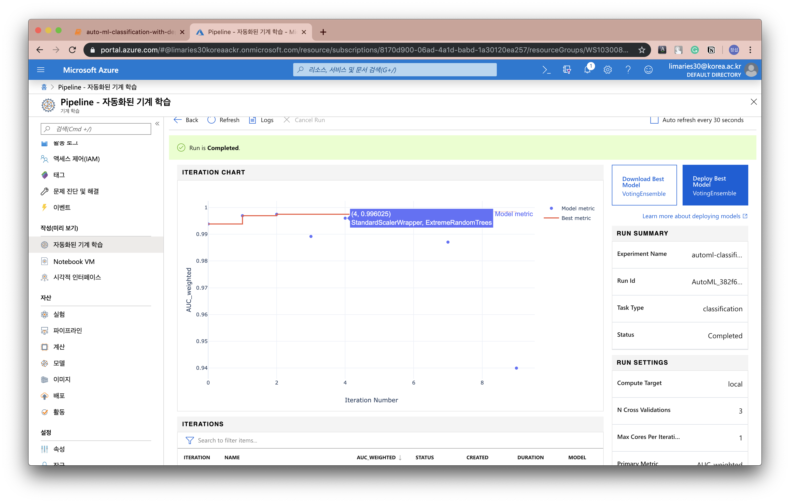

azureml 세팅하는 영상 : 
https://youtu.be/YQDnOT0ayzM

# Azure Machine Learning 을 이용한 ML pipeline

요구사항1. Serverless API(Google Functions, Azure Functions, AWS Lambda)로 머신러닝 모델 CPU 서빙
-> ACI 사용해서 서빙

요구사항2. 데이터셋은 Google BigQuery에 적재하고 꺼내서 사용
-> 굳이 BigQuery 사용할 필요는 없는 것 같아 AzureML 에서 제공하는 datastore 활용
참고 : Datastore 안에 Dataset 을 등록하는 것임

https://docs.microsoft.com/en-us/azure/machine-learning/service/how-to-create-register-datasets

요구사항3. 학습 실험 관리 Opensource(Microsoft NNI, Google Adanet, Optuna 등)를 사용하여 AutoML 수행
-> Azure autoML 사용

요구사항4. 학습이 완료되면 Model Validation을 자동으로 수행해서 지금 서빙되고 있는 모델보다 우수한지 자동으로 검증
-> Azure AutoML 에서 자동수행해서 알고리즘 고르고, 시각화까지 해줌

요구사항5. 모델리스트가 관리되어야 하고, 선택적으로 배포 및 롤백이 가능함
-> Model 리스트가 저절로 만들어짐. 선택적 배포가능. 필요에 따라 모델 변경 가능

요구사항6. 모든 코드는 Pylint 가이드에 맞춰 깔끔함을 유지 (PEP8, Google Style 등)
-> check

참고자료 :
https://docs.microsoft.com/ko-kr/azure/machine-learning/service/how-to-create-your-first-pipeline
